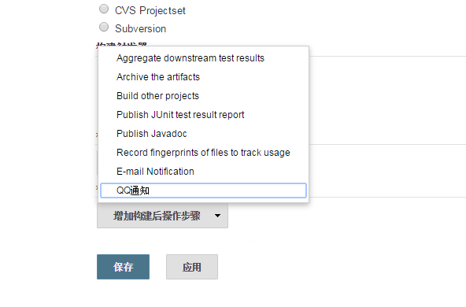
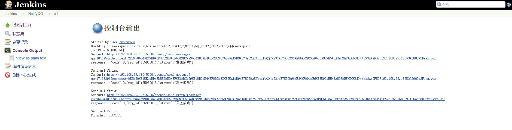
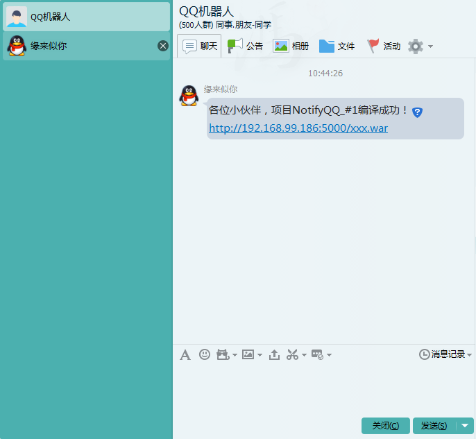
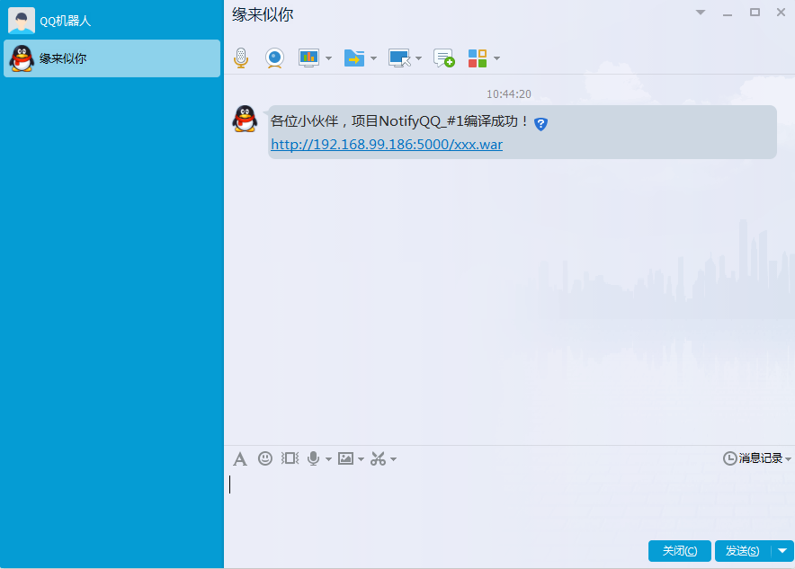

# NotifyQQ
This is a Jenkins notify plugin, send a message to QQ when a job is finished.

I think this is a demand for Chinese only, so I will write the follow readme content in Chinese. if you want it change to English, please let me know.

## 使用说明

需要做如下准备：

1. 基于WebQQ协议，[Mojo-Webqq](https://github.com/sjdy521/Mojo-Webqq)，运行openqq模块。
2. (可选)Jenkins插件编写基础。
3. 安装NotifyQQ插件，在job配置界面设置需要通知的QQ号，支持群号和个人号。
4. 注意：该插件依赖[Mojo-Webqq](https://github.com/sjdy521/Mojo-Webqq)的运行，否则不能正常工作。
5. 使用Maven构建，即`mvn hpi:hpi`最终输出`NotifyQQ.hpi`、`NotifyQQ.jar`文件，在Jenkins插件列表中安装`NotifyQQ.hpi`即可。
## Screenshots

* Jenkins配置

* NotifyQQ插件配置

* NotifyQQ插件输出

* NotifyQQ插件QQ群消息输出

* NotifyQQ插件QQ个人消息输出

## 参考资料

https://wiki.jenkins-ci.org/display/JENKINS/Plugin+tutorial

https://wiki.jenkins-ci.org/display/JENKINS/Extend+Jenkins

## 感谢

感谢[go3k](https://github.com/go3k)给了我灵感，该项目基于[go3k](https://github.com/go3k)的[NotifyQQ](https://github.com/go3k/NotifyQQ)项目修改而来。最后感谢[灰灰](https://github.com/sjdy521)缔造了开源项目[Mojo-Webqq](https://github.com/sjdy521/Mojo-Webqq)并为此带来了便利。

## 与我联系

* QQ:*184675420*

* Email:*sxyx2008#gmail.com*(#替换为@)

* HomePage:*[aimeizi.net](http://aimeizi.net)*

* Weibo:*[http://weibo.com/qq184675420](http://weibo.com/qq184675420)*(荧星诉语)

* Twitter:*[https://twitter.com/sxyx2008](https://twitter.com/sxyx2008)*

# License

MIT

Copyright (c) 2016 aimeizi